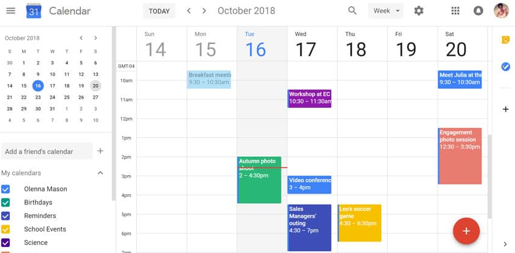
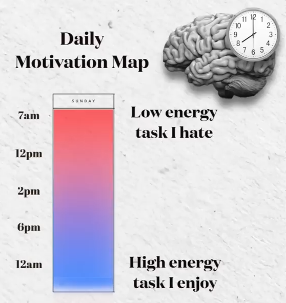
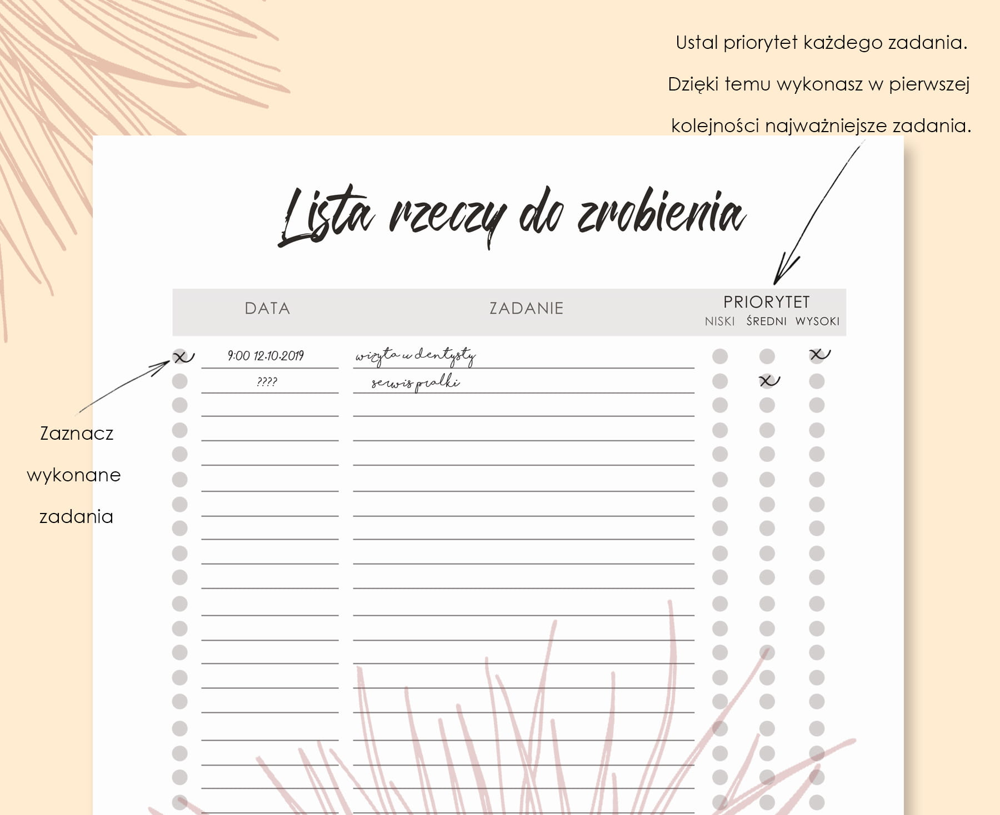
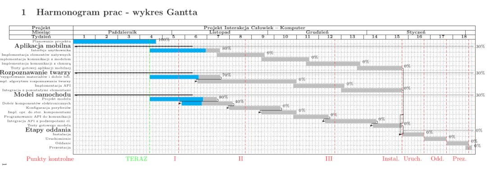

# Agenda
- Wprowadzenie
	<!---
	tu mówię o tym o czym będę gadał przez ~ 15 min, o zarządzaniu czasem osobistym, nie w projektach
	--->
	- dwa typy mózgów,
	- zarządzanie czasem dla uporządkowanych i nieogarniętych,
- Część główna
	- prawo Parkinsona,
	- zasada Pareta,
	- pomodoro,
	- time boxing,
	- czeklisty i to-do listy
	- narzędzia do zarządzania czasem,
	- zarządzanie czasem przy projektach,
	- diagramy gannta.
- Zakończenie
	- bibliografia,
	- pytania.

# Dwa typy mózgów

Dr. Daniel Amen zidentyfikował 16 typów mózgów w oparciu o różne metody neuroobrazowania.

- 5 podstawowych typów mózgu,
- 11 kombinacji podstawowych typów.

{height=50%}

# Dwa typy mózgów

| Typ 1.	| Typ 2.	|
|-----------|-----------|
| pełna równomierna aktywność całego mózgu| niższa aktywność w korze mózgu |
| uporządkowany | chaotyczny |
| zdyscyplinowany | ciężko o skupienie i motywację |
| zwykle nie podejmuje ryzyka | impulsywny i porywczy |
| planowo wykonuje zadania | potrzebuje stymulacji aby pozostać skupionym |

# Zarządzanie czasem dla uporządkowanych i nieogarniętych,

| Typ 1. (uporządkowany)	| Typ 2. (nieogarnięty)	|
|---------------------------|-----------------------|
| harmonogramy, rozpiski, listy rzeczy do zrobienia | mapy motywacji, sugestie, podzielenie zadań na kategorie trudności |
| wykonywanie zadań po kolei | wykonywanie zadań zależnie od motywacji i ochoty |

# Zarządzanie czasem dla uporządkowanych

{height=80%}

# Zarządzanie czasem dla nieuporządkowanych

{height=80%}

# Prawo Parkinsona

"Praca rozszerza się tak, aby wypełnić czas dostępny na jej ukończenie"
Cyril Northcote Parkinson

# Zasada Pareta

"20% badanych obiektów związanych jest z 80% pewnych zasobów"

nawiązując do prawa Parkinsona: 20% tekstu pozwala zrozumieć 80% treści.

# Pomodoro

{height=40%}

# Pomodoro

1. Zdecyduj, jakie zadanie ma być wykonane.
2. Ustaw czasomierz na 25 minut (tradycyjnie 25 minut)
3. Pracuj nad zadaniem.
4. Zakończ pracę, gdy zadzwoni zegar i umieść znacznik kontrolny na kartce.
5. Jeśli masz mniej niż cztery znaczniki kontrolne, zrób krótką przerwę (3 – 5 minut), a następnie przejdź do kroku 2.
6. Po czterech pomodoros, zrób dłuższą przerwę (15 – 30 minut), wyzeruj liczbę znaczników, a następnie przejdź do kroku 1.

# Time boxing

10 zaplanowanych godzin ~= 15 niezaplanowanych godzin

Time boxing - Przypisywanie zadań do skończonych bloków czasowych

Wykorzystuje prawo Parkinsona aby dobrze wykorzystać dostępny czas.

Bloki mniejsze niż 15 - 30 min. powinny być zgrupowane razem z innymi czynnościami aby uniknąć mikrozarządzania i tracenia dostępnego czasu na planowanie.

# Czeklisty i to-do listy

{height=80%}

# Czeklisty i to-do listy

Wady:

- Mózg szuka łatwych wygranych, dlatego prioretyzuje zadania prostsze jako pierwsze do wykonania,
- Brak widocznych proporcji oraz priorytetów zadań w porównaniu do techniki time boxingu.

# Zarządzanie czasem przy projektach

Poniższe aplikacje umożliwiają na przydzielanie konkretnych zadań do osób, integrację z systemami kontroli wersji (github, bitbucket, gitlab).

- Jira,
- Asana,
- *Notion*,
- Trello. 

# Narzędzia do zarządzania prywatnym czasem

## time boxing

- Aika ($4 / mc.),
- *Notion*,
- Google Calendar,
- kartka papieru.

## to-do

- Microsoft To Do,
- *Notion*,
- Todoist,
- kartka papieru.

# Narzędzia do zarządzania prywatnym czasem

## pomodoro

- stoper,
- telefon.

# Diagram Gantta (Harmonogram Adamieckiego)

{height=80%}

# Bibliografia

- Atomowe nawyki, James Clear
- https://brainmd.com/blog/which-of-the-16-brain-types-are-you/
- https://pl.wikipedia.org/wiki/Prawo_Parkinsona
- https://pl.wikipedia.org/wiki/Diagram_Gantta

# Dziękuję bardzo za uwagę

Czas na pytania
